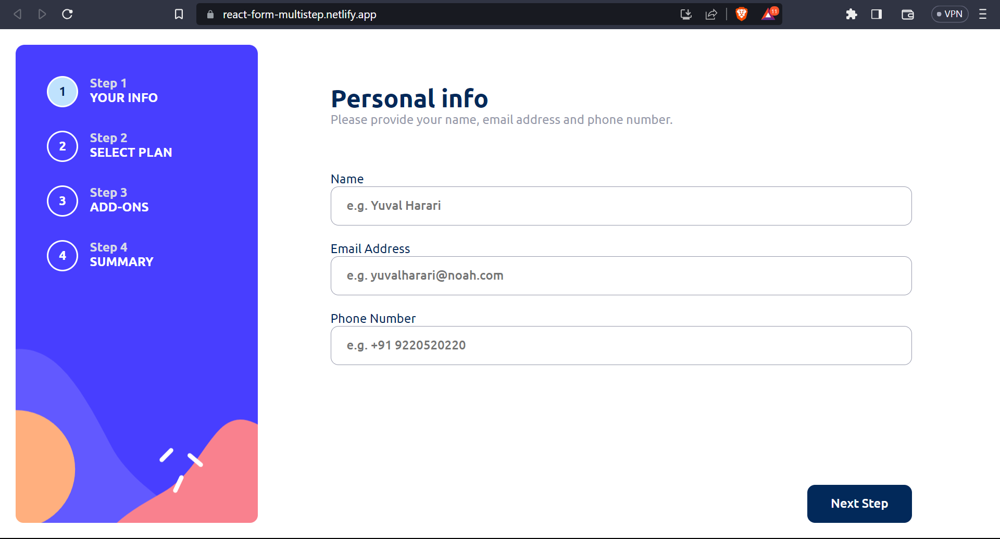

# Multi-step form with ReactJs

## Table of contents

- [Overview](#overview)
  - [The challenge](#the-challenge)
  - [Screenshot](#screenshot)
  - [Links](#links)
- [My process](#my-process)
  - [Built with](#built-with)
- [Author](#author)

## Overview

### The challenge

Users should be able to:

- Complete each step of the sequence
- Go back to a previous step to update their selections
- See a summary of their selections on the final step and confirm their order
- View the optimal layout for the interface depending on their device's screen size
- See hover and focus states for all interactive elements on the page
- Receive form validation messages if:
  - A field has been missed
  - The email address is not formatted correctly
  - A step is submitted, but no selection has been made

### Screenshot

### Links

- Solution URL: [Frontend Mentor](https://www.frontendmentor.io/solutions/responsive-multi-step-form-in-reactjs-p8ZcZ9xm2J)
- Live Site URL: [Netlify](https://react-form-multistep.netlify.app/)

## My process

### Built with

- CSS custom properties
- Flexbox
- CSS Grid
- Mobile-first workflow
- [React](https://reactjs.org/) - JS library

## Author

- Frontend Mentor - [@Gauravtripathii](https://www.frontendmentor.io/profile/Gauravtripathii)
- Linked In - [@gaurav kumar tripathi](https://www.linkedin.com/in/gaurav-kumar-tripathii/)
- Twitter - [@gaurav0tripathi](https://twitter.com/gaurav0tripathi)
